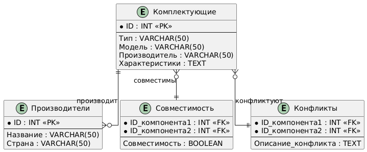

# Курсовая работа: Разработка модели реляционной базы данных для учета комплектующих и определения их совместимости при сборке персональных компьютеров

## Введение
В современном мире компьютеры играют ключевую роль во многих сферах деятельности. При сборке компьютера важно правильно подобрать комплектующие, чтобы они были совместимы друг с другом. В данной курсовой работе будет разработана модель реляционной базы данных для учета комплектующих и определения их совместимости при сборке персональных компьютеров.

**Цель работы**:
- Разработать базу данных для учета комплектующих.
- Реализовать механизм проверки совместимости компонентов.
- Определить конфликты между комплектующими.

---

## Анализ предметной области

### Описание предметной области
При сборке персонального компьютера необходимо учитывать совместимость комплектующих. Это включает в себя процессоры, материнские платы, видеокарты, блоки питания, оперативную память и другие компоненты.

### Основные сущности
1. **Комплектующие** (ID, тип, модель, производитель, характеристики).
2. **Производители** (ID, название, страна).
3. **Совместимость** (ID_компонента1, ID_компонента2, совместимость).
4. **Конфликты** (ID_компонента1, ID_компонента2, описание конфликта).

### Требования к базе данных
- Хранение информации о комплектующих.
- Проверка совместимости компонентов.
- Определение конфликтов между компонентами.
- Возможность поиска и анализа данных.

---

## Проектирование базы данных

### ER-диаграмма
 *(Здесь можно вставить изображение ER-диаграммы)*

### Таблицы
#### 1. Комплектующие
```sql
CREATE TABLE Komplektuyushchie (
    ID INT PRIMARY KEY,
    tip VARCHAR(50),
    model VARCHAR(50),
    proizvoditel VARCHAR(50),
    harakteristiki TEXT
);
```

#### 2. Производители
```sql
CREATE TABLE Proizvoditeli (
    ID INT PRIMARY KEY,
    nazvanie VARCHAR(50),
    strana VARCHAR(50)
);
```

#### 3. Совместимость
```sql
CREATE TABLE Sovmestimost (
    ID_komplektuyushchego1 INT,
    ID_komplektuyushchego2 INT,
    sovmestimost BOOLEAN,
    PRIMARY KEY (ID_komplektuyushchego1, ID_komplektuyushchego2),
    FOREIGN KEY (ID_komplektuyushchego1) REFERENCES Komplektuyushchie(ID),
    FOREIGN KEY (ID_komplektuyushchego2) REFERENCES Komplektuyushchie(ID)
);
```

#### 4. Конфликты
```sql
CREATE TABLE Konflikty (
    ID_komplektuyushchego1 INT,
    ID_komplektuyushchego2 INT,
    opisanie_konflikta TEXT,
    PRIMARY KEY (ID_komplektuyushchego1, ID_komplektuyushchego2),
    FOREIGN KEY (ID_komplektuyushchego1) REFERENCES Komplektuyushchie(ID),
    FOREIGN KEY (ID_komplektuyushchego2) REFERENCES Komplektuyushchie(ID)
);
```

---

## Разработка базы данных

### Создание таблиц
```sql
-- Создание таблиц
CREATE TABLE Komplektuyushchie (
    ID INT PRIMARY KEY,
    tip VARCHAR(50),
    model VARCHAR(50),
    proizvoditel VARCHAR(50),
    harakteristiki TEXT
);

CREATE TABLE Proizvoditeli (
    ID INT PRIMARY KEY,
    nazvanie VARCHAR(50),
    strana VARCHAR(50)
);

CREATE TABLE Sovmestimost (
    ID_komplektuyushchego1 INT,
    ID_komplektuyushchego2 INT,
    sovmestimost BOOLEAN,
    PRIMARY KEY (ID_komplektuyushchego1, ID_komplektuyushchego2),
    FOREIGN KEY (ID_komplektuyushchego1) REFERENCES Komplektuyushchie(ID),
    FOREIGN KEY (ID_komplektuyushchego2) REFERENCES Komplektuyushchie(ID)
);

CREATE TABLE Konflikty (
    ID_komplektuyushchego1 INT,
    ID_komplektuyushchego2 INT,
    opisanie_konflikta TEXT,
    PRIMARY KEY (ID_komplektuyushchego1, ID_komplektuyushchego2),
    FOREIGN KEY (ID_komplektuyushchego1) REFERENCES Komplektuyushchie(ID),
    FOREIGN KEY (ID_komplektuyushchego2) REFERENCES Komplektuyushchie(ID)
);
```

### Наполнение таблиц тестовыми данными
```sql
-- Наполнение таблиц
INSERT INTO Komplektuyushchie (ID, tip, model, proizvoditel, harakteristiki)
VALUES 
(1, 'Процессор', 'Intel Core i5-10400F', 'Intel', 'Socket LGA1200, 6 ядер, 12 потоков'),
(2, 'Материнская плата', 'ASUS TUF Gaming B460-PRO', 'ASUS', 'Socket LGA1200, DDR4, M.2 SSD'),
(3, 'Видеокарта', 'NVIDIA GeForce RTX 3060 Ti', 'NVIDIA', 'PCIe 4.0 x16, 8 ГБ GDDR6');

INSERT INTO Proizvoditeli (ID, nazvanie, strana)
VALUES 
(1, 'Intel', 'США'),
(2, 'ASUS', 'Тайвань'),
(3, 'NVIDIA', 'США');

INSERT INTO Sovmestimost (ID_komplektuyushchego1, ID_komplektuyushchego2, sovmestimost)
VALUES 
(1, 2, TRUE), -- Intel Core i5-10400F и ASUS TUF Gaming B460-PRO совместимы
(2, 3, FALSE); -- ASUS TUF Gaming B460-PRO и NVIDIA GeForce RTX 3060 Ti несовместимы

INSERT INTO Konflikty (ID_komplektuyushchego1, ID_komplektuyushchego2, opisanie_konflikta)
VALUES 
(2, 3, 'Видеокарта NVIDIA GeForce RTX 3060 Ti требует больше энергии, чем может предоставить материнская плата ASUS TUF Gaming B460-PRO.');
```

---

## Работа с базой данных

### Примеры SQL-запросов

#### 1. Поиск совместимых комплектующих
```sql
SELECT k1.model AS komponent1, k2.model AS komponent2
FROM Komplektuyushchie k1
JOIN Sovmestimost s ON k1.ID = s.ID_komplektuyushchego1
JOIN Komplektuyushchie k2 ON k2.ID = s.ID_komplektuyushchego2
WHERE s.sovmestimost = TRUE;
```

#### 2. Определение конфликтов между выбранными компонентами
```sql
SELECT k1.model AS komponent1, k2.model AS komponent2, k.opisanie_konflikta
FROM Komplektuyushchie k1
JOIN Konflikty k ON k1.ID = k.ID_komplektuyushchego1
JOIN Komplektuyushchie k2 ON k2.ID = k.ID_komplektuyushchego2;
```

#### 3. Формирование списка рекомендуемых комплектующих для сборки
```sql
SELECT k1.model AS komponent1, k2.model AS komponent2
FROM Komplektuyushchie k1
JOIN Sovmestimost s ON k1.ID = s.ID_komplektuyushchego1
JOIN Komplektuyushchie k2 ON k2.ID = s.ID_komplektuyushchego2
WHERE s.sovmestimost = TRUE;
```

---

## Оптимизация и защита базы данных

### Создание индексов
```sql
CREATE INDEX idx_komplektuyushchie_tip ON Komplektuyushchie(tip);
CREATE INDEX idx_sovmestimost_id_komplektuyushchego1 ON Sovmestimost(ID_komplektuyushchego1);
CREATE INDEX idx_konflikty_id_komplektuyushchego1 ON Konflikty(ID_komplektuyushchego1);
```

### Настройка прав доступа
```sql
GRANT SELECT, INSERT, UPDATE, DELETE ON Komplektuyushchie TO user1;
GRANT SELECT ON Sovmestimost TO user2;
REVOKE INSERT ON Konflikty FROM user3;
```

### Защита от SQL-инъекций
```sql
-- Пример использования подготовленных выражений (например, в Python)
-- cursor.execute("SELECT * FROM Komplektuyushchie WHERE model = %s", (model,))
```

---

## Заключение
В данной курсовой работе была разработана модель реляционной базы данных для учета комплектующих и определения их совместимости при сборке персональных компьютеров. База данных позволяет хранить информацию о комплектующих, проверять их совместимость и определять конфликты. Реализованы SQL-запросы для поиска совместимых компонентов, определения конфликтов и формирования рекомендаций.

---

## Приложения

### Полный код SQL-скриптов
```sql
-- Создание таблиц
CREATE TABLE Komplektuyushchie (
    ID INT PRIMARY KEY,
    tip VARCHAR(50),
    model VARCHAR(50),
    proizvoditel VARCHAR(50),
    harakteristiki TEXT
);

CREATE TABLE Proizvoditeli (
    ID INT PRIMARY KEY,
    nazvanie VARCHAR(50),
    strana VARCHAR(50)
);

CREATE TABLE Sovmestimost (
    ID_komplektuyushchego1 INT,
    ID_komplektuyushchego2 INT,
    sovmestimost BOOLEAN,
    PRIMARY KEY (ID_komplektuyushchego1, ID_komplektuyushchego2),
    FOREIGN KEY (ID_komplektuyushchego1) REFERENCES Komplektuyushchie(ID),
    FOREIGN KEY (ID_komplektuyushchego2) REFERENCES Komplektuyushchie(ID)
);

CREATE TABLE Konflikty (
    ID_komplektuyushchego1 INT,
    ID_komplektuyushchego2 INT,
    opisanie_konflikta TEXT,
    PRIMARY KEY (ID_komplektuyushchego1, ID_komplektuyushchego2),
    FOREIGN KEY (ID_komplektuyushchego1) REFERENCES Komplektuyushchie(ID),
    FOREIGN KEY (ID_komplektuyushchego2) REFERENCES Komplektuyushchie(ID)
);

-- Наполнение таблиц
INSERT INTO Komplektuyushchie (ID, tip, model, proizvoditel, harakteristiki)
VALUES 
(1, 'Процессор', 'Intel Core i5-10400F', 'Intel', 'Socket LGA1200, 6 ядер, 12 потоков'),
(2, 'Материнская плата', 'ASUS TUF Gaming B460-PRO', 'ASUS', 'Socket LGA1200, DDR4, M.2 SSD'),
(3, 'Видеокарта', 'NVIDIA GeForce RTX 3060 Ti', 'NVIDIA', 'PCIe 4.0 x16, 8 ГБ GDDR6');

INSERT INTO Proizvoditeli (ID, nazvanie, strana)
VALUES 
(1, 'Intel', 'США'),
(2, 'ASUS', 'Тайвань'),
(3, 'NVIDIA', 'США');

INSERT INTO Sovmestimost (ID_komplektuyushchego1, ID_komplektuyushchego2, sovmestimost)
VALUES 
(1, 2, TRUE), -- Intel Core i5-10400F и ASUS TUF Gaming B460-PRO совместимы
(2, 3, FALSE); -- ASUS TUF Gaming B460-PRO и NVIDIA GeForce RTX 3060 Ti несовместимы

INSERT INTO Konflikty (ID_komplektuyushchego1, ID_komplektuyushchego2, opisanie_konflikta)
VALUES 
(2, 3, 'Видеокарта NVIDIA GeForce RTX 3060 Ti требует больше энергии, чем может предоставить материнская плата ASUS TUF Gaming B460-PRO.');
```

### ER-диаграмма

